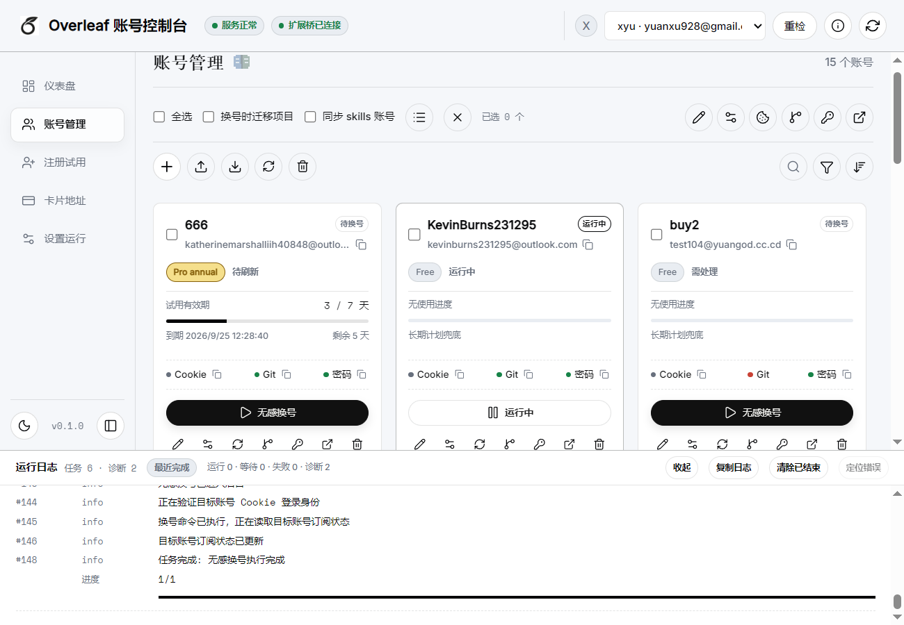
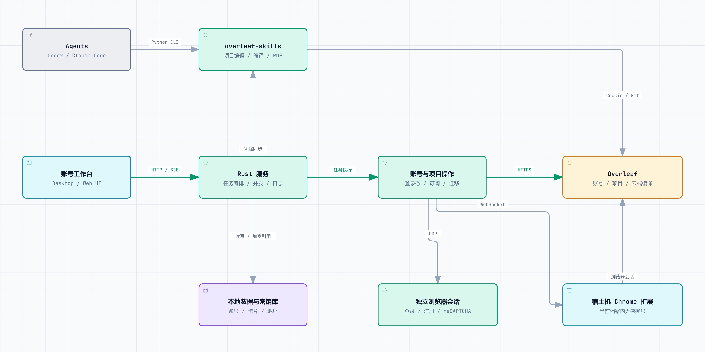
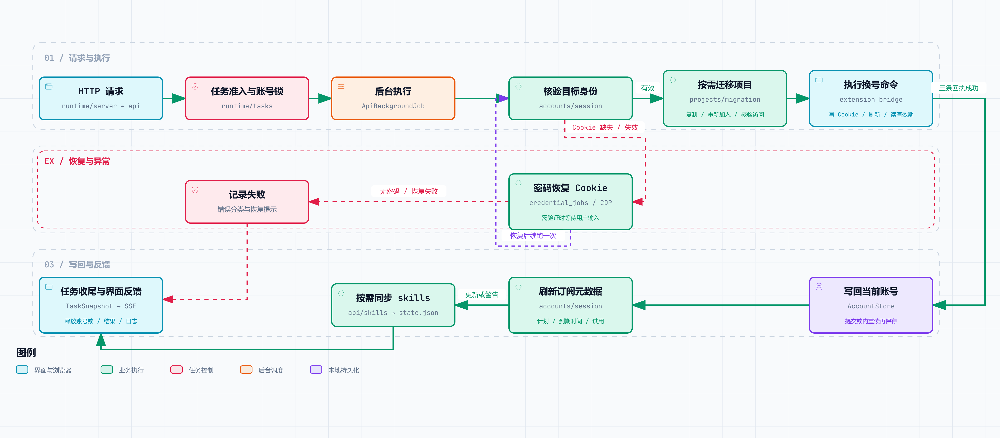
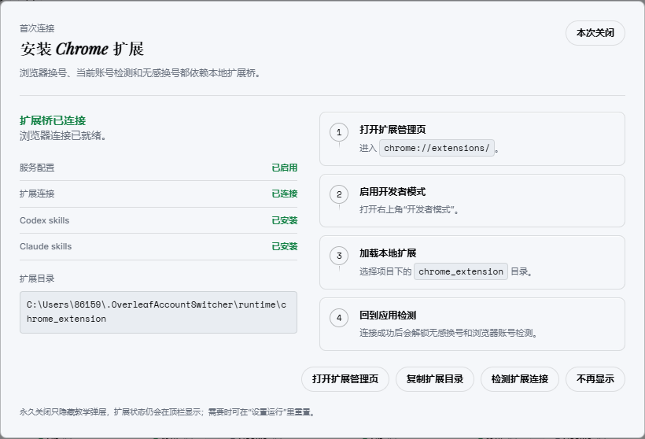
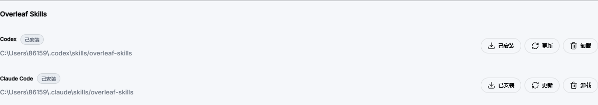

<p align="center">
  
</p>

<h1 align="center">Make Overleaf Great Again</h1>

<p align="center"><strong>Overleaf Account Switcher · A modern Overleaf workflow</strong></p>
<p align="center">Connect your agent, switch accounts seamlessly, and migrate projects so large papers aren't held back by compile timeouts.</p>
<p align="center"><a href="README.md">简体中文</a> · <strong>English</strong></p>

<p align="center">
  <a href="#development"></a>
  <a href="#download"></a>
  <a href="#download"></a>
  <a href="#docker"></a>
</p>

<p align="center">
  <a href="#about">Background</a> · <a href="#features">Features</a> · <a href="#architecture">How it works</a> ·
  <a href="#download">Downloads</a> · <a href="#quick-start">Quick start</a> ·
  <a href="#skills">Overleaf Skills</a> · <a href="#docker">Docker</a> · <a href="#structure">Project structure</a>
</p>

<a id="about"></a>

## As LaTeX gets easier

As LLMs improve, LaTeX typesetting and compilation become easier to get into. Agents can help set up a TeX environment, edit a paper, debug compilation errors, and produce a PDF. Often, you can simply describe the task. With permission, an agent can also work directly with local references, experiment data, and figures, without making you upload everything first.

Before that, Overleaf was the natural choice for many of us:

- **Start writing without configuring a toolchain.** No need to begin by installing TeX Live or MiKTeX, then sorting out engines, packages, fonts, and template compatibility.
- **Let the cloud do the compiling.** Compilation can be demanding. Moving it off your machine is useful, especially on less powerful hardware.
- **Templates and real-time collaboration.** Start with a working template, edit and discuss alongside coauthors, and stop passing files around or guessing which version is final.

Those benefits still matter. But writing now extends beyond the browser: an agent can configure pdfLaTeX, XeLaTeX, or LuaLaTeX for a project, run latexmk, and use local material to make edits. **LaTeX is getting easier to work with. Overleaf should fit into that modern workflow too.**

Although Overleaf has AI features of its own, repeatedly uploading material, moving context, and synchronizing edits is still a chore when your references, data, and tools live locally. Large projects can also hit the Free plan's compile timeout. Moving to another account with suitable entitlements means dealing with project migration, collaboration access, and agent credentials all over again.

An agent can handle much of a LaTeX writing workflow, but going all-in on agents is still some way from how we actually work, especially on research papers: eventually, a person needs to take over and revise. Overleaf still makes it easy to **tweak the text by hand, compile, and see the resulting PDF right away**. What we need is a bridge between agent-written drafts and hands-on editing. Connecting Overleaf to modern tools and addressing its friction points can make it that bridge. Make Overleaf great again. **Overleaf Account Switcher is a local-first workspace for Overleaf accounts and projects.** Its companion [overleaf-skills](https://github.com/YuanzAAi/overleaf-skills) lets Codex and Claude Code use local material, edit Overleaf projects, compile in the cloud, and retrieve the PDF. When you need another account, project migration, the browser session, and skills credentials move together. Keep cloud collaboration and let your agent take part, without moving everything by hand.

<a id="features"></a>

## Features

| Area | Capabilities |
| --- | --- |
| Account management | Card and list views, search and filters, bulk selection, aliases, password login, Cookie import, queued file imports, and single-file or multi-file exports. |
| Sessions and credentials | Cookie identity checks and password-based recovery, Git token retrieval and generation, local password updates, remote password changes, and credential copying and status checks. |
| Browser account switching | Switch within the current Chrome profile, verify the target identity, refresh subscription information, and optionally migrate projects and synchronize skills credentials. |
| Project management | Independent per-account project windows with copy, rename, ZIP download, PDF compilation, archive, and trash controls; choose projects before switching while preserving their order and verifying target access. |
| Overleaf Skills | Install, update, and uninstall Codex / Claude Code skills for project reads and edits, Git history, cloud compilation, and PDF / source / log downloads. |
| Registration and subscriptions | Registration, reCAPTCHA and email verification, address and payment forms, trial eligibility checks, plan changes, trial extensions, and cancellation of renewal. |
| Cards and addresses | Bulk card entry, status changes, selected exports and deletion, plus address retrieval, selection, and copying. |
| Tasks and runtime | Concurrent queues, account locks, user-input waits, cancellation and retries, live logs, proxy settings, application updates, browser profiles, and temporary-file cleanup. |

### Why Overleaf Account Switcher

- **Bring your agent into the paper workflow.** Connect local material, Overleaf projects, and compiled PDFs with less uploading and copy-pasting.
- **Move projects as you switch accounts.** When moving to an account with premium entitlements, handle project ownership and access as part of the switch.
- **Keep your browser and skills on the same account.** Optionally synchronize Cookies and Git tokens during a browser switch instead of configuring each tool separately.
- **Recover from an expired Cookie.** Accounts with saved passwords can attempt a fresh login and resume the task. reCAPTCHA and email verification wait for your input.
- **Keep compile timeouts out of the way.** With multiple accounts that have premium entitlements, browser switching and project migration let you move work to another premium account instead of staying constrained by the Free plan's compile limit.

Compile limits generally follow the **project owner's** plan; switching a collaborator's account alone does not increase them. Overleaf Account Switcher does not alter entitlements. Trial eligibility and duration come from Overleaf. See [Overleaf's premium feature documentation](https://docs.overleaf.com/getting-started/free-and-premium-plans/premium-features).

<p align="center">
  
</p>

<a id="architecture"></a>

## How it works

### How the parts connect

<p align="center">
  
</p>

The workspace sends operations to the Rust service, whose task layer manages concurrency, account locks, and progress. Account and project operations share the Overleaf HTTP client, browser automation, and extension bridge: HTTP retrieves identity, subscription, and project state; separate browser sessions handle login and subscription actions; the Chrome extension switches accounts in your everyday browser.

Account data stays local, with passwords, Cookies, Git tokens, and sensitive card fields stored in the keyring. A successful switch can synchronize skills credentials. The agent then uses Cookies for project reads and compilation, and Git for edits and history. Desktop runs the service locally; Docker runs it in a container. Agents stay on the host.

### How the backend executes a task

Browser account switching illustrates the actual execution path below. Green arrows show execution and state updates; the recovery branch handles a missing or expired Cookie.

<p align="center">
  
</p>

- **Requests and execution are separate.** `runtime/server` receives requests and `api` dispatches operations. `runtime/tasks` tracks account locks, progress, and retry information. Long-running work executes in the background while SSE sends task snapshots to the interface.
- **Session recovery uses a shared path.** `accounts/session` verifies identity; `api/credential_jobs` schedules a separate browser to recover the Cookie. reCAPTCHA or email verification waits for user input, then the original task resumes. The same browser batch machinery also handles password changes and Git token operations.
- **Confirm remote results before committing locally.** `projects/migration` optionally copies or rejoins projects and checks access. The current account is saved only after the extension sets the Cookie, refreshes tabs, and reads the expiry successfully. Subscription refresh and optional skills synchronization follow. Failures in those follow-up steps are reported separately, not as a failed account switch.

`workflows/registration` defines registration and subscription steps; `api/registration` drives the browser and checks page state. `resources` manages cards and addresses, while `accounts/io` handles account imports and exports. These modules share persistence and keyring access through `storage`. Account network operations finish before taking the commit lock, rereading the latest data, and saving, so concurrent tasks do not overwrite one another. Cancelled browser tasks finish session cleanup before releasing their account locks.

<a id="download"></a>

## Downloads

Choose your platform from [GitHub Releases](https://github.com/YuanzAAi/overleaf-account-switcher/releases):

| Platform | File | Run it |
| --- | --- | --- |
| Windows x64 | `overleaf-windows-x64.exe` | Run directly; the service and extension are embedded. |
| Windows x64 portable | `overleaf-windows-x64-portable.zip` | Extract and run `overleaf-desktop.exe`; includes a separate service and extension directory. |
| macOS Apple Silicon | `overleaf-macos-arm64-portable.zip` | Extract and open the `.app`. |
| macOS Intel | `overleaf-macos-x64-portable.zip` | Extract and open the `.app`. |
| Docker | `ghcr.io/yuanzaai/overleaf-account-switcher:latest` | Use [Docker Compose](#docker). |

If macOS cannot verify the developer on first launch, confirm the download source, then use **System Settings → Privacy & Security → Open Anyway**.

<a id="quick-start"></a>

## Quick start

### Requirements

- **Windows:** Windows 10 / 11 x64, Google Chrome, and [WebView2 Runtime](https://developer.microsoft.com/microsoft-edge/webview2/).
- **macOS:** Google Chrome, normally installed in `/Applications`.
- **Skills integration:** assumes you already use Codex or Claude Code; Python 3.10+ and Git must be available on `PATH`.

Prebuilt packages do not need Rust, Node.js, or a local TeX installation. Use current stable Chrome. Login and registration create separate temporary profiles automatically; there is no extra "temporary Chrome" executable to locate.

### Connect and use

1. **Open the application.** Run the Windows EXE or macOS `.app`. Once the service starts, you can also use `http://127.0.0.1:8765/ui/` in a browser.
2. **Load the extension.** Open `chrome://extensions/` in the target Chrome profile, enable **Developer mode**, select **Load unpacked**, and choose the directory shown by the app.
3. **Add accounts.** Import account files, paste a Cookie, or log in with an email and password. Follow task prompts for reCAPTCHA or email verification.
4. **Connect your agent.** Install the skills under Settings. Enable project migration and skills account sync as needed, then switch accounts.

<details>
<summary>Extension connection guide</summary>

<p align="center">
  
</p>

The standalone EXE extracts the extension automatically. ZIP users can load the included `chrome_extension` directory. Use the path displayed by the app. After updating extension files, click **Reload** on Chrome's extensions page.

</details>

Closing the desktop window hides it to the tray. Choose **Exit** from the tray menu to quit completely. User data lives outside the application directory.

### Updates

Check for a new release under **Settings → Application updates**. On desktop, choose **Download and update** to verify the download, replace the application, and restart while keeping account data. Finish or cancel active tasks first. Docker users can copy the Compose update commands from the same section and run them in the deployment directory. For a pinned image version, first set `OVERLEAF_IMAGE` in `.env` to the target image shown there.

<a id="skills"></a>

## Overleaf Skills

[overleaf-skills](https://github.com/YuanzAAi/overleaf-skills) also works independently. Codex and Claude Code share a Python CLI, with skills entry points adapted to each agent's format. No additional MCP service or pip dependencies are required.

<p align="center">
  
</p>

After installation and account synchronization, ask your agent:

> Use overleaf-skills to list my Overleaf projects. Read the paper's main.tex, then update the results section using my local experiment outputs. Show me the changes for approval, push them to Overleaf, compile, and download the PDF.

Cookies support reads, compilation, and downloads. Edits and history use Git with the relevant [Overleaf Git integration entitlement](https://docs.overleaf.com/integrations-and-add-ons/git-integration-and-github-synchronization/git-integration) and a Git token. Account synchronization requires both a Cookie and a Git token; if either is missing, the application reports it and preserves the previous skills state.

Synchronization applies to subsequent commands. Copies have new project IDs, so ask the agent to list projects again and confirm its target.

<a id="docker"></a>

## Docker

Install Docker Engine / Docker Desktop and Compose v2, then download this repository. Create `.docker-keyring-password` in the repository root with a single line containing a strong password you generated. It unlocks the persistent keyring; keep a secure backup.

Set the image in a root-level `.env` file:

```dotenv
OVERLEAF_IMAGE=ghcr.io/yuanzaai/overleaf-account-switcher:latest
```

```sh
docker compose -f docker/compose.yml pull
docker compose -f docker/compose.yml up -d
```

Open **http://127.0.0.1:8765/ui/** in the host's Chrome to use the same workspace as the desktop application. For browser account switching, load the repository's `chrome_extension` in that Chrome profile. It connects through local port `9876`.

Login and registration tasks use a separate browser inside the container. When reCAPTCHA is required, choose **Open task browser** in the task's waiting area or Settings to complete it. Continue everyday account operations in the Web UI.

Compose mounts the host's Codex / Claude Code skills and account-state directories. Agents still run on the host. For custom locations, set `CODEX_HOME` or `CLAUDE_CONFIG_DIR` before starting; the host needs Python and Git, and Docker needs read/write access to those directories.

<details>
<summary>Data, ports, and source builds</summary>

Account data persists in the `data` named volume. `docker compose down` keeps it; `down -v` deletes it. Keep the keyring password with your data backup.

`OVERLEAF_WEB_PORT` and `OVERLEAF_BROWSER_PORT` change the host ports for the Web UI and task browser. The extension connects to `localhost:9876`; keep that port accessible.

Ports bind to localhost by default. For remote deployment, use controlled access such as SSH tunnels rather than exposing the API or task browser directly to the internet. Skills mounts refer to the Docker host; agents on a different machine need credentials configured there.

Build from source:

```sh
docker compose -f docker/compose.yml up -d --build
```

</details>

<a id="faq"></a>

## FAQ

### Do Chrome and skills paths need manual configuration?

Usually not for standard installations. Windows checks Chrome under the current user's directory and Program Files. macOS checks `/Applications/Google Chrome.app`. Chrome 136's restrictions on debugging the default profile do not affect the separate temporary profiles used here.

<details>
<summary>Default locations and overrides</summary>

| Item | Location / setting |
| --- | --- |
| Windows data | `%USERPROFILE%/.OverleafAccountSwitcher/data`, with temporary profiles in sibling `tmp` |
| macOS data | `~/.local/share/.OverleafAccountSwitcher/data`; respects `XDG_DATA_HOME` |
| Custom data / temporary paths | `OVERLEAF_SWITCHER_DATA_DIR` / `OVERLEAF_SWITCHER_TMP_DIR` |
| Chrome executable | `OVERLEAF_SWITCHER_CHROME_PATH`; on macOS, point to `.app/Contents/MacOS/Google Chrome` |
| Chrome profile root | `OVERLEAF_SWITCHER_CHROME_USER_DATA_DIR`, the directory containing `Local State` |
| Codex skills | `~/.codex/skills/overleaf-skills`; respects `CODEX_HOME` |
| Claude Code skills | `~/.claude/skills/overleaf-skills`; respects `CLAUDE_CONFIG_DIR` |
| Skills state / cache | `<agent-home>/overleaf-skills/state.json` / `cache` |

Set environment variables before launching the app. The skills installer invokes `python` on Windows and `python3` on macOS. When launching from Finder, make sure those commands are available to the application.

If you customize `OVERLEAF_SKILL_STATE_DIR`, use the same directory for the application and agent. Explicit credentials and `OVERLEAF_SESSION` / `OVERLEAF_GIT_TOKEN` override the state file. Check them first if the agent keeps using an old account after a switch.

</details>

### What survives project migration?

Owned projects are copied to the target account. Shared projects are rejoined when permissions allow, with copying used where needed. Copies have new IDs, and history, comments, and collaboration relationships may not be preserved unchanged. Some migration paths enable link sharing or send invitations. Back up important projects and check content and access afterward.

### Where are accounts and credentials stored?

Passwords, Cookies, Git tokens, card numbers, and security codes are stored in the system keyring; internal JSON stores references. Explicit exports and skills `state.json` contain plaintext credentials. Do not publish them or commit them to Git. Use export / import when moving between machines, not a copy of internal JSON alone.

This project is not affiliated with Overleaf. Use accounts and projects you own or are authorized to access, and follow trial eligibility and payment rules. Subscription operations may incur real charges.

<a id="structure"></a>

## Project structure

```text
overleaf-account-switcher/
├── apps/
│   ├── web/               # Account, registration, resource and settings pages; state, logs and themes
│   └── desktop/           # Tauri windows, tray, dialogs, clipboard and service process management
├── crates/
│   ├── core/              # Account, project and card models with foundational rules
│   ├── storage/           # Data locations, account and resource persistence, system keyring
│   ├── browser/           # Chrome profiles, CDP automation, browser lifecycle and extension bridge
│   ├── overleaf-api/      # Overleaf identity, subscription and project APIs; response parsing
│   ├── workflows/         # Registration, subscription and project migration workflow definitions
│   └── service/           # Local API, account operations, task orchestration, concurrency and skills
├── chrome_extension/      # Browser-session operations and WebSocket bridging
├── docker/                # Container environment, Compose configuration and browser runtime
├── scripts/               # Windows and macOS packaging scripts
├── docs/                  # Product screenshots and system diagrams
├── .github/workflows/     # Automated builds, GitHub Releases and Docker image publishing
└── Cargo.toml             # Rust workspace and shared dependency configuration
```

<a id="development"></a>

## Development and builds

The Rust workspace implements the service and business logic. Tauri 2 supplies the desktop window, tray, and native integration. esbuild bundles the vanilla JavaScript / CSS interface.

Use current stable Rust (minimum 1.88), Node.js 22, and npm. Windows needs MSVC and Visual Studio C++ Build Tools; macOS needs Xcode Command Line Tools.

```sh
npm --prefix apps/web ci
npm --prefix apps/desktop ci
```

Windows:

```powershell
powershell -ExecutionPolicy Bypass -File scripts/package-desktop.ps1
```

macOS:

```sh
bash scripts/package-macos.sh aarch64-apple-darwin
# Intel: bash scripts/package-macos.sh x86_64-apple-darwin
```

Artifacts are written to `target/desktop-package/`. The [build workflow](.github/workflows/build.yml) supports manual builds; pushing a `v*` tag builds and publishes desktop artifacts and Docker images.

## Acknowledgments

- [Overleaf](https://www.overleaf.com/) and the TeX / LaTeX ecosystem.
- [overleaf-mcp-plus](https://pypi.org/project/overleaf-mcp-plus/) and [mjyoo2/OverleafMCP](https://github.com/mjyoo2/OverleafMCP), for their work on Overleaf tool integration.

## License

[MIT](LICENSE)

## Community

<a href="https://linux.do"></a>
